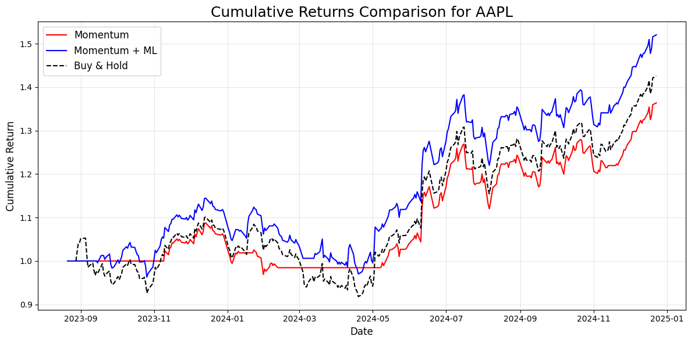

# ML-Augmented Momentum Strategy

## Overview

This project explores a hybrid quantitative trading strategy that enhances a traditional momentum signal—Exponential Moving Average (EMA) crossover—with a supervised machine learning overlay. The goal is to study whether ML can selectively override rule-based signals to improve overall return and signal quality.

- **Base strategy**: Buy/sell based on short vs. long EMA crossover
- **ML overlay**: A classifier model (e.g., logistic regression) overrides signals if its prediction confidence is high
- **Data**: Daily stock prices from Yahoo Finance via `yfinance`
- **Evaluation**: Out-of-sample backtesting with parameter optimization of EMA windows

---

## Project Goals

- Evaluate whether ML overlays can improve traditional rule-based signals
- Learn to build and backtest trading strategies using Python
- Demonstrate applied skills in ML and alpha generation

---

## Strategy Breakdown

- **Base Strategy**: Momentum using short/long EMA crossover (buy when short EMA > long EMA and sell vice versa)
- **ML Model Overlay**: Overrides the base strategy if the model's confidence score is above threshold
  - Trained on hand-crafted features (momentum indicators, volatility, volume, etc.)
  - Threshold for confidence score is tunable, but fixed at 0.5 for simplicity now

---

## Evaluation

- Backtesting is performed on historical data
- Strategy returns are compared with:
  - Baseline EMA-only strategy
  - Buy-and-hold benchmark
- Parameters (EMA window lengths) are optimized using brute-force grid search

---

## Early Findings

- The ML-enhanced strategy can outperform the pure EMA strategy in some out-of-sample tests
- High-confidence thresholds (e.g., ≥0.5) allow ML to act selectively and can improve risk-adjusted return
- Overriding too frequently (low threshold) can reduce performance — ML must be confident to add value
- The improvements appear more significant when the rule-based baseline is simple (e.g., EMA crossover)

> Example: AAPL stock (1.3-year daily data, out-of-sample)
> - Buy-and-hold return: ~143%
> - Baseline EMA strategy return: ~136%
> - ML-augmented strategy return: ~152% 
>
> 

---

## Acknowledgements

Parts of the backtesting logic, including the EMA crossover momentum strategy, are adapted from the Korean quant finance book "Building Quant Investment Portfolios Using Python" by Jo Daepyo.  
All machine learning enhancements and additional development were implemented independently.