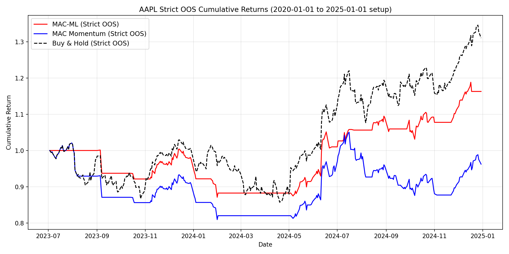

# Project: ML-Augmented Momentum Strategy

## Overview
* Goal: How best to buy and hold a stock to maximize its return, where you can buy and hold however much you want?
* Hybrid approach that combines a simple momentum-based strategy---EMA crossover strategy---with supervised ML model overlays
* ML model that selectively override the momentum-based strategy if the confidence score exceeds some threshold
* Data is sourced from Yahoo Finance
* Functionalities include backtesting, parameter optimization of EMA windows, and out-of-sample dataset evaluation

## Motivation
* The EMA crossover, momentum-based strategy only considers the long and short term trends in stock price, neglecting any other factors
* This can be a useful first step, but how to incorporate additional signals?
* What if we combine the elements of both this momentum-based approach with ML-based classifier that can override when it is fairly certain whether to buy or sell the stock?
* To what extent can using various signals, ranging from technical indicators to various aggregate statistics, help improve performance?
* (The simple EMA crossover strategy is a simplistic example, but the goal here is to investigate the effect of ML on stock returns)

## Result (Strict Out-of-Sample)

Main claim in this repository is based on strict out-of-sample (OOS) testing with no future-label leakage in inference:

* Ticker/date range: `AAPL`, `2020-01-01` to `2025-01-01`
* Split: chronological `70/30` (train/test), no shuffle
* OOS evaluation window starts on `2023-07-03`
* Strategy settings: `short_window=10`, `long_window=30`

OOS cumulative return comparison (same test window):

| Strategy | Return |
| --- | ---: |
| MAC-ML (threshold auto-selected to 0.70) | +16.29% |
| MAC momentum baseline | +3.56% |
| Buy & hold | +31.04% |

Interpretation:

* ML overlay outperformed the pure momentum baseline in this window.
* Buy-and-hold still outperformed both active strategies in this window.
* Performance is threshold-sensitive: with fixed `ml_threshold=0.5`, MAC-ML returned `+2.73%` (below MAC baseline).

### Strict OOS Visualization



## CLI Usage

This project now includes a CLI for training, prediction, backtesting, and visualization.

Run from project root:

```bash
python -m src.cli --help
```

### 1) Train

From Yahoo Finance:

```bash
python -m src.cli train \
  --ticker AAPL --start 2018-01-01 --end 2024-12-31 \
  --threshold-mode auto --val-ratio 0.2 \
  --model-out artifacts/model.pkl
```

From CSV (must include `Date, Open, High, Low, Close, Volume`):

```bash
python -m src.cli train \
  --csv data/aapl.csv --date-column Date \
  --threshold-mode auto --val-ratio 0.2 \
  --model-out artifacts/model.pkl
```

### 2) Predict

```bash
python -m src.cli predict \
  --model-in artifacts/model.pkl \
  --ticker AAPL --start 2024-01-01 --end 2024-12-31 \
  --output artifacts/predictions.csv

# Optional: override saved threshold
# --threshold 0.65

# Output columns:
# open, high, low, close, volume, prediction, prob_up, signal, threshold_used
# where signal is:
#   1 -> high-confidence buy (prob_up >= threshold)
#   0 -> high-confidence sell (prob_up <= 1 - threshold)
#  -1 -> no-action zone
```

### 3) Backtest (+ Optional Plots)

Rule-based MAC:

```bash
python -m src.cli backtest \
  --ticker AAPL --start 2018-01-01 --end 2024-12-31 \
  --strategy mac --short-window 10 --long-window 30 \
  --output artifacts/backtest_mac.csv
```

ML-augmented MAC:

```bash
python -m src.cli backtest \
  --ticker AAPL --start 2018-01-01 --end 2024-12-31 \
  --strategy mac-ml --short-window 10 --long-window 30 \
  --threshold-mode auto --val-ratio 0.2 \
  --plot-strategy --plot-cumulative \
  --output artifacts/backtest_mac_ml.csv
```

### 4) Visualize Saved Results

```bash
python -m src.cli visualize \
  --results-csv artifacts/backtest_mac_ml.csv \
  --mode both --ticker-label AAPL
```

## Acknowledgements

Parts of the backtesting logic, including the EMA crossover momentum strategy, are adapted from the Korean quant finance book  
**"Building Quant Investment Portfolios Using Python"** by **Jo Daepyo**.  
All machine learning enhancements and additional development were implemented independently.
